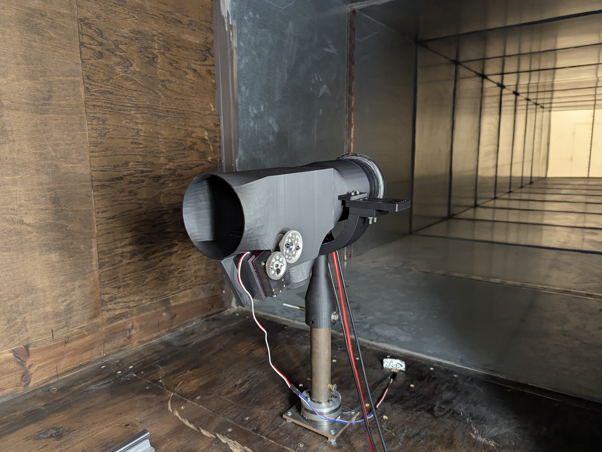

# Electric Ducted Fan Thrust Vectoring Control System

## Project Overview

This repository contains the Arduino control code and data acquisition system for my graduate research project focused on developing novel thrust vectoring capabilities for Electric Ducted Fans (EDFs). The project aims to integrate two custom thrust vectoring EDFs onto a UAV airframe to enable Vertical Takeoff and Landing (VTOL) operations.

## Research Context

This work is part of a larger research initiative to advance electric propulsion systems for next-generation aircraft. The project addresses the critical need for versatile, efficient thrust vectoring solutions in both military UAV applications (like enhanced MQ-1C Gray Eagle capabilities) and civilian eVTOL markets (similar to the Lilium Jet architecture).



[Watch video demo](https://photos.app.goo.gl/ygxQjdd6iMZp2emF9)

## Current Project Status

**Phase 2: Physical Analysis & Data Acquisition (December 2025 - January 2026)**

We are currently in the propulsion system characterization phase, having completed:
- ✅ System foundation and architecture design
- ✅ Complete experimental test rig assembly
- ✅ Inertial property measurements
- 🔄 **Currently executing:** Thrust stand testing and data collection

### Project Timeline
- **Phase 1**: System Foundation & Architecture ✅
- **Phase 2**: Physical Analysis & Data Acquisition 🔄
- **Phase 3**: SIL Development & Integration
- **Phase 4**: HIL Integration
- **Phase 5**: HIL Testing & Finalization

## Hardware Configuration

### Propulsion System
- **EDF Unit**: E-Jets Jetfan 120mm Pro (carbon fiber housing, 11-blade rotor)
- **Motor**: HET Typhoon 800-73 590KV BLDC (8-pole, 495g)
- **ESC**: ZTW Skyhawk 160A HV (with 10A SBEC)
- **Power**: High-capacity LiPo battery pack with 10 AWG wiring

### Control & Data Acquisition
- **Microcontroller**: Arduino Mega 2560
- **Force Measurement**: ATI Industrial Mini85 six-axis load cell
- **Data Acquisition**: National Instruments USB-6210 (16-bit, 250 kS/s)
- **Servo Control**: Timer5-based PWM (Pin 46) for thrust vectoring
- **ESC Control**: Timer4-based PWM (Pin 6)

## Key Features

### Real-Time Control
- Servo-actuated thrust vectoring with automatic sweep capability
- ESC throttle control via PWM (1000-2000μs range)
- Serial command interface for manual control
- Synchronized 100ms data logging interval

### Telemetry Integration
- Real-time ESC telemetry via UART (115.2k baud)
- Voltage, current, RPM, and temperature monitoring
- 32-byte packet structure with error checking
- Dual serial port configuration for external data streams

### Data Acquisition
- Six-axis force and moment measurement
- High-frequency thrust data logging
- Synchronized propulsion system parameters
- LabVIEW integration for advanced analysis

## Performance Results

Our baseline characterization has yielded significant performance data:

### Peak Performance Metrics
- **Maximum Static Thrust**: 46.2 N (4.71 kgf)
- **Peak Input Power**: 3.07 kW at 95% throttle
- **System Efficiency**: 1.53 gf/W at maximum power
- **Peak Efficiency**: 2.5 gf/W at lower power settings
- **Motor Speed Range**: 9,703 - 22,830 RPM

### Thrust Vectoring Capability
Based on our nozzle characterization data:
- **Maximum Vectored Thrust**: 24.08 N (forward)
- **Maximum Vectored Lift**: 28.58 N (upward)
- **Operating Range**: Flap positions 1-99 degrees
- **Thrust Vectoring Efficiency**: Up to 97.54% of maximum thrust maintained

### Power System Performance
- **Voltage Range**: 43.6V - 49.7V under load
- **Current Draw**: Up to 70.4A at maximum power
- **Thermal Management**: ESC temperatures within operational limits
- **Power Density**: Suitable for UAV integration

## Data Analysis

### Polynomial Thrust Model

Our thrust prediction model uses a second-order polynomial with exponential weighting:

```latex
F_{thrust} = a_0 + a_1 \cdot P + a_2 \cdot P^2 + a_3 \cdot \theta + a_4 \cdot \theta^2 + a_5 \cdot P \cdot \theta
```

Where:
- F_{thrust} = Generated thrust force (N)
- P = PWM pulse width (μs)
- θ = Flap deflection angle (degrees)

### Data Filtering Results
- **Total Data Points Collected**: 974
- **Filtered Dataset (15% tolerance)**: 721 points
- **Thrust Tolerance**: ±6.35 N
- **Lift Tolerance**: ±5.71 N

### 3D Data Plots


## Usage Instructions

### Basic Operation
1. Upload the Arduino code to your Mega 2560
2. Connect the ESC telemetry line to Serial1 (Pin 19)
3. Connect external data source to Serial2 (Pin 17)
4. Open Serial Monitor at 115200 baud
5. Send commands in format: `servo_state,pwm_value`

### Command Examples
- `1,1150` - Start servo motion and set PWM to 1150μs
- `0,1100` - Stop servo motion and set PWM to 1100μs  
- `1150` - Set PWM to 1150μs only

### Safety Features
- Automatic ESC arming sequence (3-second delay)
- PWM range validation (1000-2000μs)
- Servo home position return capability
- Real-time telemetry monitoring

## Technical Specifications

### Control System
- **Update Rate**: 50Hz for servo control
- **Data Logging**: 10Hz synchronized output
- **PWM Resolution**: 16-bit Timer precision
- **Serial Rates**: 115.2k (telemetry), 9600 (external data)

### Performance Envelope
- **Thrust Range**: 0 - 46.2 N
- **Power Range**: 0 - 3.07 kW
- **Servo Range**: 0 - 80 degrees sweep
- **Response Time**: <20ms servo updates

## Future Development

This baseline characterization enables our upcoming research phases:

### Phase 3 Goals
- Custom Gazebo physics modeling
- ROS 2 high-level controller development
- PX4 SITL integration

### Phase 4-5 Objectives
- Hardware-in-the-loop implementation
- Full VTOL flight testing
- Performance validation

## Publications

Our preliminary results have been published in:
- *"Design and System Integration for Experimental Testing of Electric Ducted Fans (EDFs)"* - AIAA Conference Proceedings

## Collaboration

This research is conducted at Tennessee Technological University in collaboration with:
- Department of Mechanical Engineering
- Subsonic Wind Tunnel Facility
- Advanced Materials Laboratory

## Contact

For technical questions or collaboration inquiries regarding this research, please refer to the published documentation or contact the research team through official academic channels.

---

*This project represents ongoing graduate research in electric propulsion and thrust vectoring control systems. All experimental procedures follow established safety protocols and institutional guidelines.*